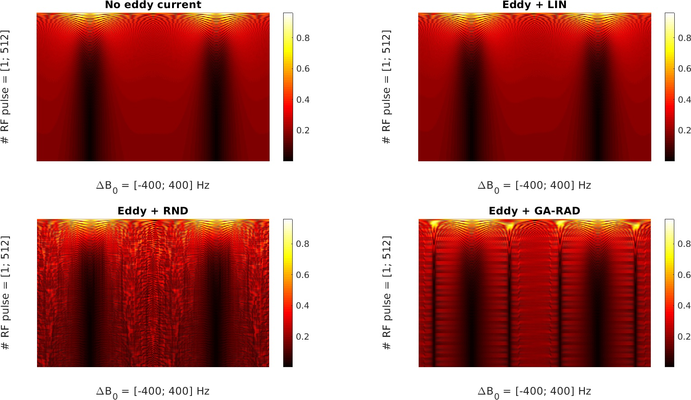
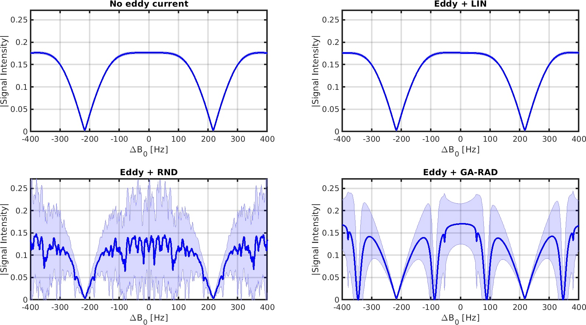

**These script reproduce some of the work shown in the article:**

T. Bruijnen, B. Stemkens, C.A.T. van den Berg and R.H.N. Tijssen.
"Prospective GIRF-based RF phase cycling to reduce eddy current-induced steady-state disruption in bSSFP imaging."
Accepted in Magnetic Resonance in Medicine on 04-Nov-2019.

The files contain matlab code **1)** to process gradient measurements from k-space data; **2)** to calculate gradient impulse response functions and **3)** to simulate eddy current-induced steady-state disruption using bloch equations. In addition we provide a freely available set of gradient impulse response functions. The four figures below summarize these three functionalities respectively. The scripts are tested on matlab-2015a & matlab-2019a.

**Figure 1** summarizes the processing of the gradient measurements. Where the left-top panel shows an example of a triangular input gradient waveform. Top-right panel shows the measured accumulated phase of the k-space data. Bottom-left shows the corresponding Brodksy analysis (0th order eddy currents) and bottom-right shows the corresponding Duyn analysis (1th order eddy currents).

**Figure 2** summarizes the calculation of the gradient impulse response functions (GIRFs). Where the left-top panel shows the magnitude of the zeroth order GIRFs. Top-right panel shows the argument of the zeroth order GIRFs. Bottom-left shows the magnitude of the first order GIRFs. Bottom-right shows the first order GIRFs in the complex plane, which are heart-shaped for the 1.5T Philips Ingenia systems.

**Figure 3** shows the signal intensities of spins with and without eddy current induced by three different sampling schemes. The colorbar indicates the signal intensities, where black indicates the typical signal voids we see with bSSFP.

**Figure 4** shows a compressed version of figure 3 which indicates how the steady--state is (not) reached.

### References

[1] Jeff H. Duyn,Yihong Yang, Joseph A. Frank, and Jan Willem van der Veen.
"Simple Correction Method for k-Space Trajectory Deviations in MRI"

[2] Ethan K. Brodsky, Jessica L. Klaers, Alexey A. Samsonov,Richard Kijowski and Walter F. Block.
"Rapid Measurement and Correction of Phase Errors from B0 Eddy Currents: Impact on Image Quality for Non-Cartesian Imaging"

[3] Signe J. Vannesjo,Maximilan Haeberlin,Lars Kasper,Matteo Pavan,Bertram J. Wilm,Christoph Barmet,Klaas P. Pruessmann.
"Gradient system characterization by impulse response measurements with a dynamic field camera"

[4] Brian Hargreaves's Bloch simulation code
http://mrsrl.stanford.edu/~brian/blochsim/

For questions or suggestions please contact me @ t.bruijnen@umcutrecht.nl.

