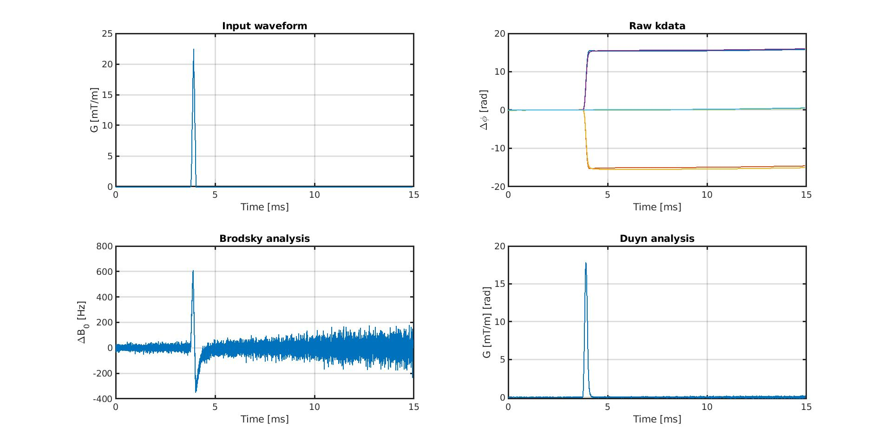
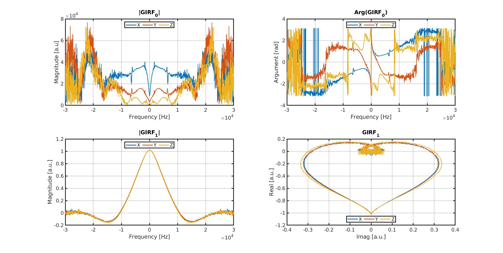

# Matlab code to support my paper own eddy current-induced steady-state disruption as described in:

T. Bruijnen, B. Stemkens, C.A.T. van den Berg and R.H.N. Tijssen
Prospective GIRF-based RF phase cycling to reduce eddy current-induced steady-state disruption in bSSFP imaging.

The files contain matlab code **1)** to process gradient measurements from k-space data; **2)** to calculate gradient impulse response functions and **3)** to simulate eddy current-induced steady-state disruption using bloch equations. The three figures below summarize these three functionalities respectively.

**The code is based on the following three papers and the publically available bloch simulation code:**

Jeff H. Duyn,Yihong Yang, Joseph A. Frank, and Jan Willem van der Veen
Simple Correction Method for k-Space Trajectory Deviations in MRI

Ethan K. Brodsky, Jessica L. Klaers, Alexey A. Samsonov,Richard Kijowski and Walter F. Block
Rapid Measurement and Correction of Phase Errors from B0 Eddy Currents: Impact on Image Quality for Non-Cartesian Imaging

Signe J. Vannesjo,Maximilan Haeberlin,Lars Kasper,Matteo Pavan,Bertram J. Wilm,Christoph Barmet,Klaas P. Pruessmann
Gradient system characterization by impulse response measurements with a dynamic field camera

Brian Hargreaves's Bloch simulation code
http://mrsrl.stanford.edu/~brian/blochsim/

